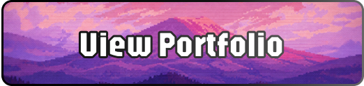

  <picture>
    <source media="(prefers-color-scheme: light)" 
      srcset="https://pixel-profile.vercel.app/api/github-stats?username=TheMilize&theme=fuji">
    <source media="(prefers-color-scheme: dark)" 
      srcset="https://pixel-profile.vercel.app/api/github-stats?username=TheMilize&theme=fuji&screen_effect=true">
    
  </picture>

---
<!-- //width="100" -->

  &nbsp;&nbsp;&nbsp;&nbsp;&nbsp;&nbsp;
  &nbsp;&nbsp;&nbsp;&nbsp;&nbsp;&nbsp;
  

---

<b>Backend</b> — Node.js • Express • REST API • RBAC  
 
<b>Database</b> — PostgreSQL • Relational design • Query optimization  
 
<b>Frontend</b> — Vue.js • Component architecture • ES6+  
 
<b>Focus</b> — Internal systems • Scalable logic • Clean structure

